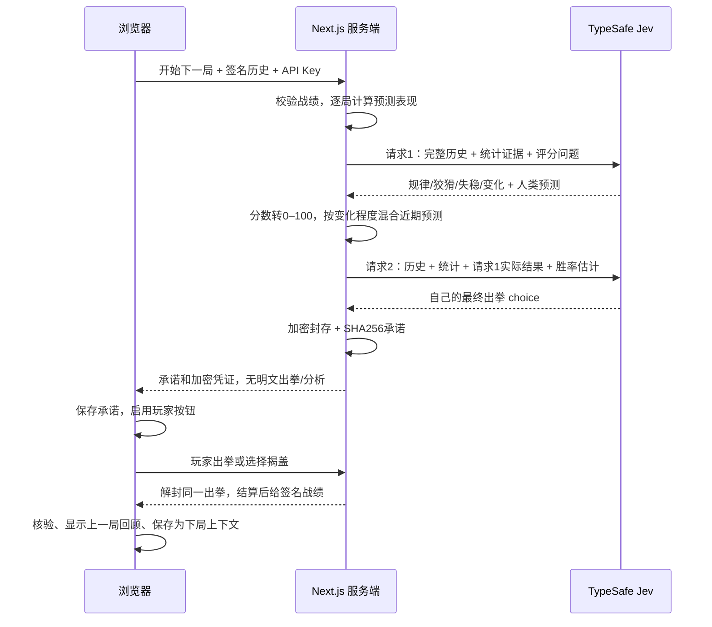
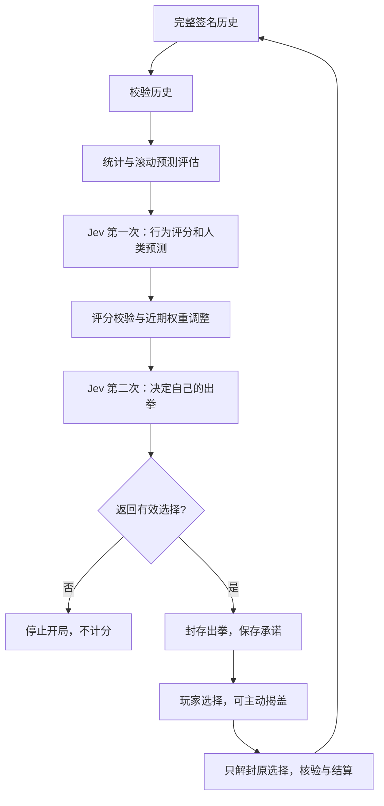
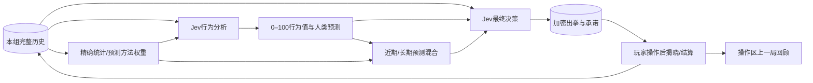

# Jev 的两阶段策略

每局两次真正的 Jev API 调用，均发生在玩家选择之前。两次都传完整历史，字段为 `[局号, 人类出拳, Jev出拳, 胜者, 是否提前揭盖]`。不会传当前或未来出拳。

| 行为值 | 可观察的证据 | 如何影响判断 |
| --- | --- | --- |
| 规律程度 | 频率、循环、转移预测的历史和近期命中表现 | 有证据时继续针对稳定规律 |
| 狡猾程度 | 针对 Jev 之前出拳的反制、多次更换策略 | 只有实际反制记录才考虑反向预判 |
| 失稳程度 | 输棋后换拳/重复，与赢棋和平局后的差异 | 有足够样本才参考输棋后的出拳条件 |
| 策略变化 | 近期分布漂移、旧方法近期失败、新方法近期成功 | 直接调整短期预测混合权重 |

Jev 的四个 `score` 均用 5 档文字规则定义，数值范围 0–4，乘以 25 转换成 0–100。少于 8 局未揭盖数据返回 `null`；失稳还要求至少 4 次输棋后转移。样本充分程度 `min(1, 未揭盖局数/30)` 是程序的启发式指标，不是校准过的置信概率。所谓失稳不能诊断真实心理状态。

V3 的 29 种预测加入二阶反制、连续轮换、三类结果后的条件反应，并把 Jev 主观预测严格限制为行为提示。第二次决策的主信号是离散策略：人类刚赢时预测其继续反制 Jev 上一拳，其余情况使用两步转移规律；模型判断只在规律程度达到 65/100 时以最多 0.10 的权重参与，避免第一阶段以很高置信度猜错时连续吃亏。程序的滚动预测负责给最终动作排序。每个目标的答案只能在该次预测完成后用于更新损失；揭盖目标不更新损失。两条损失序列采用 0.94 和 0.70 的遗忘系数。

第二次请求的近期混合权重为 `0.15 + 0.70 × 策略变化分数/100`；样本不足用 0.15。人类刚刚获胜且至少有一次未揭盖转移证据时，反制 Jev 上一拳的预测作为主信号；其权重为 `min(0.75, 0.35 + 0.40 × 狡猾程度/100)`。其余情况使用两步转移预测。每个 Jev 出拳的预估获胜概率等于它克制的人类手势概率。**最终仍封存 Jev 返回的 choice，程序不会替换为自己的建议。**

这是可被审计的历史适应，不是 Jev 模型微调。更多局数可能暴露更多规律，也可能发现对手已换套路；不保证胜率随局数单调增长。对独立均匀随机出拳，没有可持续的预测优势。真实对照结果和局数应一起解读，不能把程序对手的高胜率等同于对所有人类的保证。
