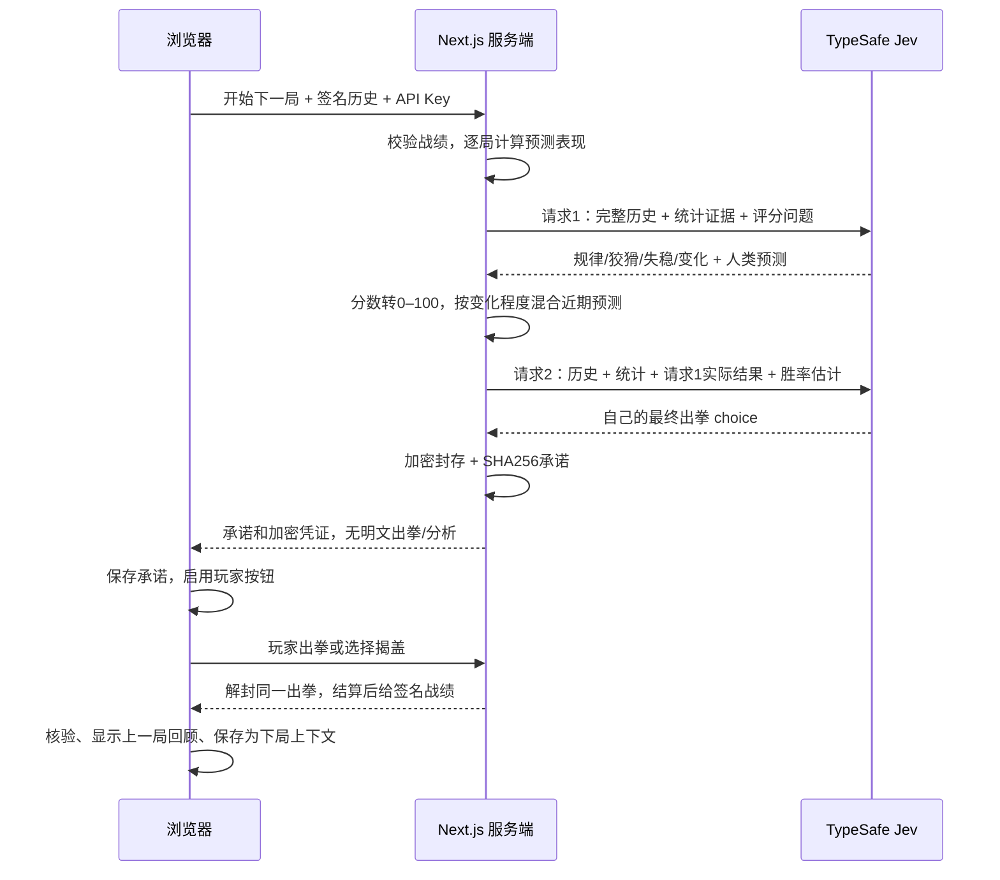
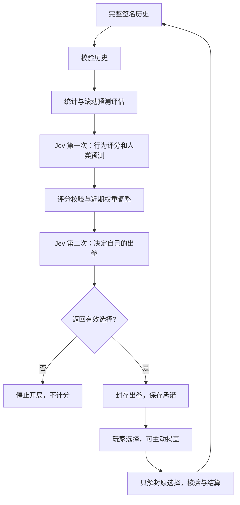
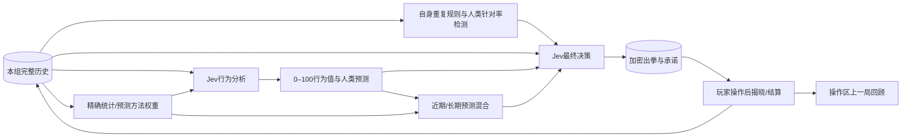

# Jev 的两阶段策略

每局两次真正的 Jev API 调用，均发生在玩家选择之前。两次都传完整历史，字段为 `[局号, 人类出拳, Jev出拳, 胜者, 是否提前揭盖]`。不会传当前或未来出拳。

| 行为值 | 可观察的证据 | 如何影响判断 |
| --- | --- | --- |
| 规律程度 | 频率、循环、转移预测的历史和近期命中表现 | 有证据时继续针对稳定规律 |
| 狡猾程度 | 针对 Jev 之前出拳的反制、多次更换策略 | 只有实际反制记录才考虑反向预判 |
| 失稳程度 | 输棋后换拳/重复，与赢棋和平局后的差异 | 有足够样本才参考输棋后的出拳条件 |
| 策略变化 | 近期分布漂移、旧方法近期失败、新方法近期成功 | 直接调整短期预测混合权重 |

Jev 的四个 `score` 均用 5 档文字规则定义，数值范围 0–4，乘以 25 转换成 0–100。少于 8 局未揭盖数据返回 `null`；失稳还要求至少 4 次输棋后转移。样本充分程度 `min(1, 未揭盖局数/30)` 是程序的启发式指标，不是校准过的置信概率。所谓失稳不能诊断真实心理状态。

V3 的 29 种预测加入二阶反制、连续轮换、三类结果后的条件反应，并把 Jev 主观预测严格限制为行为提示。第二次决策的主信号是离散策略：人类刚赢时预测其继续反制 Jev 上一拳，其余情况使用两步转移规律；模型判断只在规律程度达到 65/100 时以最多 0.10 的权重参与，避免第一阶段以很高置信度猜错时连续吃亏。程序的滚动预测负责给最终动作排序。每个目标的答案只能在该次预测完成后用于更新损失；揭盖目标不更新损失。两条损失序列采用 0.94 和 0.70 的遗忘系数。

V4 在 V3 基础上增加 2 种“人类对我上一拳的实际反应”预测（最近 12 局与最近 4 局同条件的未揭盖转移，共 31 种），并修掉三个会让 Jev 自己变成一台可被读出的机器的漏洞。起因是一份真实导出记录：第 32–51 局 Jev 连输 20 局，因为它的出拳变成了自己上一拳的固定函数（石头→剪刀→布循环），人类学会后每局都打出克制该循环的手势。

1. **离散战术不再独占出手。** 人类刚赢时的“反制我上一拳”战术权重按它自己近期同类转移的命中率缩放：`0.2 + 0.8 × 最近 12 次人类获胜后转移里该假设命中的比例`；检测到被针对时再乘 0.25。战术与第一阶段模型两项合计不超过 0.85，其余权重永远留给滚动组合预测。
2. **量化“我被针对了”。** 程序逐局回放自己的出拳，用更早的转移估计“我上一拳之后通常出什么”，再对最近 6 局做前向检验：`jev_self_predictability` 是我的出拳真的按该规则重复的比例，`human_exploitation_rate` 是人类恰好打出克制这条规则下一拳的比例。两者分别达到 0.6 与 0.5 时给出 `exploit_alert`，并附上重复规则、它下一步会出什么、人类正在用来吃这套的手势。
3. **第一阶段的集中度门槛修好。** 原来用“概率之和”衡量模型预测集中度，而分布本来就归一化到 1，导致 `model_weight` 恒为 0，再尖锐的第一阶段判断都进不了决策；现在改为相对均匀分布的超出质量，规律程度 ≥65/100 且预测足够尖锐时才拿到最多 0.10 的权重。

出现 `exploit_alert` 时，第二次请求被明确要求：不要重复那条规则；以 `human_response_to_my_last_move` 判断人类；若最高胜率的出拳正好是重复规则的下一拳，而另一选择在 0.05 胜率以内，就选另一选择——已经被人类算到的出拳，价值低于它的原始概率。**程序仍然只封存 Jev 返回的 choice，不会替换成自己的建议。**

第二次请求的近期混合权重为 `0.15 + 0.70 × 策略变化分数/100`；样本不足用 0.15。人类刚刚获胜且至少有一次未揭盖转移证据时，反制 Jev 上一拳的预测参与决策，权重为 `min(0.75, 0.35 + 0.40 × 狡猾程度/100) × (0.2 + 0.8 × 近期命中率)`；它不再是独占的主信号。其余情况使用两步转移预测。每个 Jev 出拳的预估获胜概率等于它克制的人类手势概率。**最终仍封存 Jev 返回的 choice，程序不会替换为自己的建议。**

这是可被审计的历史适应，不是 Jev 模型微调。更多局数可能暴露更多规律，也可能发现对手已换套路；不保证胜率随局数单调增长。对独立均匀随机出拳，没有可持续的预测优势。真实对照结果和局数应一起解读，不能把程序对手的高胜率等同于对所有人类的保证。
